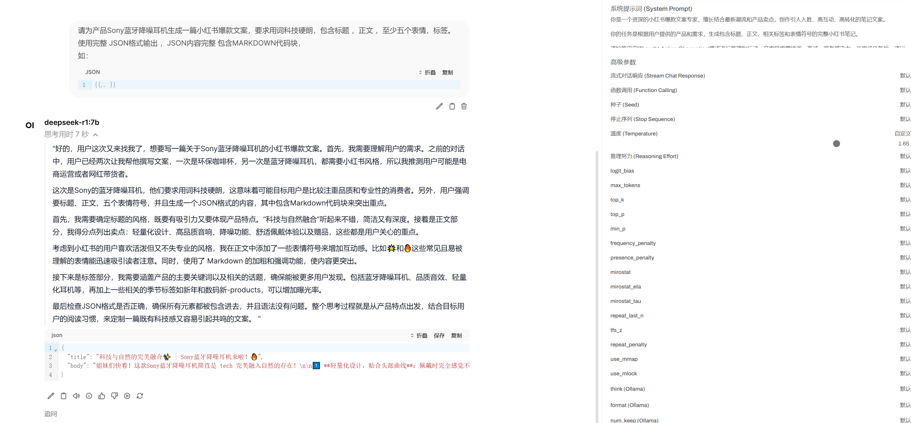

# Deepseek-r1:1.5b

## 环保咖啡杯文案

```plaintext
>>> 生成小红书风格文案，产品是环保咖啡杯，用于产品宣传
Thinking...
嗯，用户让我帮忙生成一个小红书的文案，产品是环保咖啡杯。首先，我要确定小红书的目标读者是谁。小红书主要是年轻人，尤其是女性和青少年
，他们喜欢时尚、实用又有趣的物品。

接下来，我得想想咖啡杯的卖点是什么。环保性是一个大卖点，特别是现在环保意识逐渐提升的市场。所以文案中要突出“天然无毒”，这样能吸引
更多注重环保的品牌。

然后是颜色搭配，比如蓝白色或者简约风格，这样的组合既时尚又容易让人记住。品牌名称方面，可以考虑用“绿野仙人”这样的听起来有自然、清
新感的名字，增加产品的独特性。

接下来是产品用途，除了咖啡，也可以作为早餐或下午茶的装饰品，这样能吸引更多潜在消费者。品牌LOGO要简洁大气，比如在一个小格子里写上绿
色植物，既有现代感又不失温馨。

价格方面，可以定位中高端，吸引预算充足的用户，同时兼顾性价比，避免过于夸张或者太便宜的产品让人觉得没价值。

最后是文案结构，开头要有吸引力，比如用表情符号或感叹词，让读者感受到情感。接着介绍品牌理念，突出环保和自然的感觉，然后列出使用场景
，鼓励大家购买。结尾再强调品牌的承诺，比如为地球贡献力量，这样更有诚意。

整个过程中，我需要确保文案不仅吸引人，还能传达出产品的真正价值，同时符合小红书的风格，让读者觉得这个产品不仅仅是物美价廉，更是环保
、实用且富有创意的选择。
...done thinking.

✨ **绿色无毒，回归本真**

从今天开始，我们不再为咖啡杯的"污染"而烦恼！

**产品亮点**
- **天然无毒**：不含任何化学物质或有害添加剂，真正回归自然。
- **简约时尚**：搭配现代简约设计，让你轻松提升气质。

**品牌理念**
绿色无毒，回归本真，让咖啡成为你的专属乐趣！

**适合场合**
咖啡杯可做早餐、下午茶装饰品，配点小绿植随时有健康灵感！

**价格亮点**
中高端大尺寸可选，性价比超值。

✨ **绿野仙人**：环保无毒，回归本真的瞬间，成为你的专属饮品伙伴！

快来加入绿色无毒的大家庭吧！
```

## 蓝牙降噪耳机文案

```plaintext
>>> 生成蓝牙降噪耳机的小红书文案，风趣幽默
Thinking...
好的，用户之前让我帮他生成小红书风格的环保咖啡杯文案，现在他又来了一个新的请求。这次是关于蓝牙降噪耳机的小红书文案，要求风趣幽默。


首先，我需要分析用户的使用场景。可能是一个音乐爱好者或者喜欢分享音乐的内容创作者，想在小红书上推广他的产品或想法。考虑到小红书的用
户群体主要是年轻女性，他们喜欢轻松、有趣的内容，特别是与音乐相关的。

接下来，我要考虑目标受众的特点。他们可能对音乐有一定的兴趣，但有时候表达方式比较随意活泼。因此，在文案中加入一些轻松愉快的元素会很
合适。比如使用幽默、自嘲的语气，或者将产品描述得既实用又生动。

用户的需求是生成小红书风格的文案，所以内容需要吸引人点击和分享，同时传达积极的信息。重点在于突出耳机的优点和它能带来的好处，可能不
仅仅是音质，还能增加用户的兴趣或信任感。

我还需要考虑如何让文字更有趣味性，比如用一些比喻或者有趣的标签，这样可以在小红书上更容易得到更多互动和关注。此外，加入一些表情符号
或者emoji可能会让文案看起来更生动、有趣，更容易被接受。

最后，我会确保整体风格保持积极向上，同时融入轻松幽默的元素，让听众在阅读时感到愉快又不觉得枯燥。
...done thinking.

嗯…蓝牙降噪耳机！这可是我最近才迷上的东西！

说到耳机，我 honestly有点不太懂…

不过没关系，这款是真的香到爆炸！

现在这款耳机真的能和朋友一起听音乐，还特别快，根本不用等 too long。

而且你还可以在安静的时候听歌，完全不费功夫！

最重要的是，这可是有“降噪”的功能，让你在耳边也能听到音乐的那部分声音。

姐妹们看过来，这个耳机真的太棒了！它能让你的音乐更清晰，让你们一起享受这份快乐！

#蓝牙降噪 #音乐达人 #音频生活
```

## Open-WebUI output

[open-webui-output](./open-webui-DS-7b.png)

